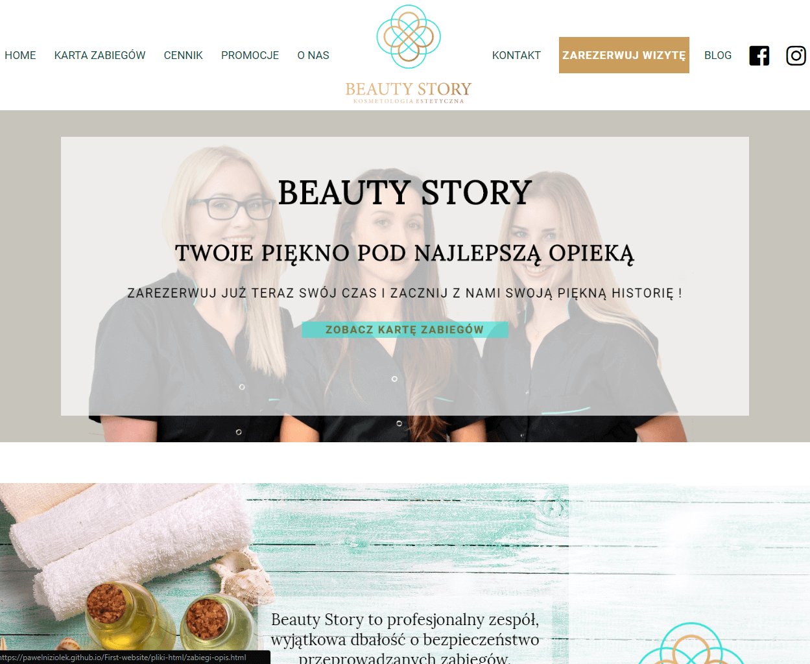

# First-website

This is my first website, using the example of a beauty salon. I used html, css, JavaScript and a bit of jQuery.

## Table of contents

- [Screenshots](#screenshots)
- [Technologies](#technologies)
- [Setup](#setup)
- [Status](#status)
- [Inspiration](#inspiration)
- [Contact](#contact)

## Screenshots

## Technologies

- HTML
- CSS
- JavaScript
- jQuery - version 3.3.1.min.js

## Setup

[link to the website](https://pawelniziolek.github.io/First-website/index.html)

## Status

Project is: _finished_

## Inspiration

Based on [Beauty-Story](https://www.beauty-story.pl/)

## Contact

Created by [Paweł Niziołek](pawel.r.niziolek@gmail.com) - contact me!
